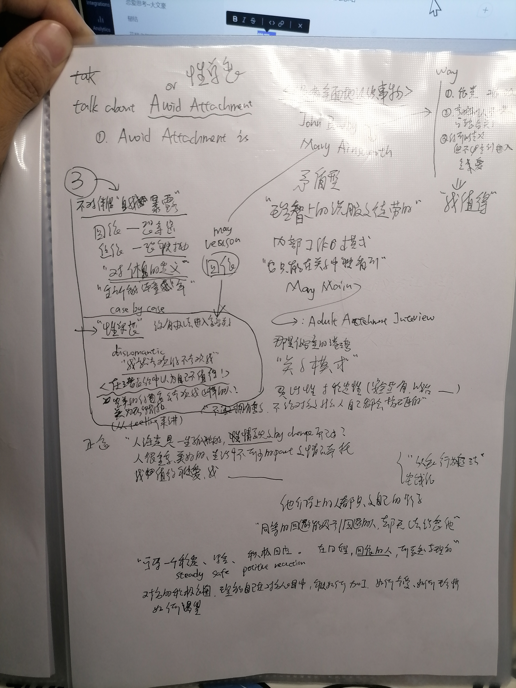

# about 回避依恋 or 性单恋

**问题：**大文豪: 就是喜欢一个人

大文豪: 在他没有回应的时候

大文豪: 喜欢地废寝忘食 辗转反侧

大文豪: 回应之后呢，就会无感咯

**学习：**

**曾经的想法**：  
“

1. 要有那种莫名的自信，我觉得这个人我就是能拿下， 哎，他就是能拿下，哎，**自信不需要理由 （**这样的男人在女人眼中，自然是有魅力的，女人会上赶着去追、、自信也包括，你相信你配得上她。如果你自己都不相信，那还是算了。你没办法说服别人相信一个自己都不信的道理。**）**

”

**对问题更加深刻的认识**：

1. 潜意识里，我有自卑的心理，会觉得我配不上我的爱慕对象，（因为我意识到，正常人都会有这样的心理）
2. 潜意识里，我感到对方（尤其是我的爱慕对象）不会喜爱、爱慕、珍惜我，我是没有可能被爱的，我也不值得被爱，别人的爱在我这里也没有value
3. 事实上，我也感受不到，表达不出，我对一个 individual 的爱

 **My Way：**

1.  **认知行为疗法**的核心就是调整认知，从多角度认知事物，用更积极更有利的认知观念指导自己的生活，让自己更有信心更有力量。改变自己精神状态和生活状态。
2. 所以我的意思是给自己洗脑，建立不一样的认知
3. 核心是动脑子，用心感受人们之间的爱
4. 走进自己的童年，呐

